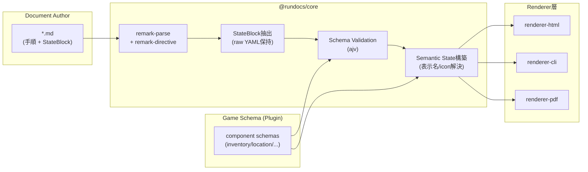

# Speedrun ドキュメンテーション基盤 — アーキテクチャ設計

> 第一目的: **人間が読めるドキュメント**。AI/機械可読性は Schema を介した副次的な恩恵。

---

## 0. 設計の要旨

```
Markdown (自然言語)  ←── 人間が主に読み書きする層
   ├─ 手順・解説・注意事項
   └─ StateBlock (:::state)  ←── 期待状態のチェックポイント
          └─ YAML             ←── 状態記述専用言語（表示方法は書かない）
                └─ Schema      ←── 意味・型・表示メタデータを定義
                      └─ Renderer ──→ UI (HTML / CLI / PDF)
```

責務分離は一本の軸で貫きます。

| レイヤー | 責務 | やらないこと |
|---|---|---|
| Markdown | 手順・解説・理由を書く | 状態やUIを書かない |
| YAML (State) | 「今こうなっているはず」という値を宣言する | 表示形式・色・アイコンを書かない |
| Schema | キー・型・enum・表示名・アイコン・Renderer向けメタデータを定義する | 値そのものは持たない |
| Component | 意味のあるまとまり（Inventory, Location…）を表す概念 | UI部品ではない |
| Renderer | Component の意味 + Schema を見て、ターゲット別UIを生成する | 状態のバリデーションはしない（Schema層の責務） |

この分離により、「人間向けドキュメント」と「機械可読な意味構造」が同一ファイル内で共存しつつ、互いを汚染しません。

---

## 1. アーキテクチャ全体

### 1.1 リポジトリ構成

```
rundocs/
├─ ARCHITECTURE.md           # 本ファイル
├─ packages/
│  ├─ core/                  # mdast拡張・remarkプラグイン・パイプライン組み立て
│  ├─ schema/                 # GameSchema型・ajvバリデーション
│  ├─ renderer-core/          # Renderer共通インターフェース・レジストリ
│  ├─ renderer-html/          # HTML Renderer（remark-rehype連携）
│  ├─ renderer-cli/           # ターミナル(ANSI) Renderer（未実装）
│  ├─ renderer-pdf/           # HTML Rendererを再利用 + 印刷用CSS/Puppeteer（未実装）
│  └─ cli/                    # `rundocs build` / `rundocs dev` コマンド
├─ plugins/
│  └─ plugin-oot/             # ゲーム固有: Schema・アイコン・カスタムRenderer
├─ books/                     # Plugin/GameSchemaを使う「本番想定」ワークスペース群
│  └─ oot-sample/
│     ├─ rundocs.config.ts
│     └─ 01-forest-temple.md
└─ docs/                      # zero-config規約（§11.2）のサンプル/ドキュメント用ワークスペース
   ├─ index.md
   └─ 01-example-route.md
```

`core` は Markdown ⇔ StateBlock の変換のみを担当し、ゲーム固有知識を一切持ちません。ゲーム知識は全て `plugins/*` に閉じ込めます。

### 1.2 全体データフロー



ポイント: **バリデーションは parse の直後、render の直前に独立したステージとして存在**します。これにより「構文（Markdown/YAML）」「意味（Schema適合）」「表現（Renderer）」の3層が明確に分かれ、将来 AI/自動チェックがこの Validate ステージだけを叩けば機械可読な検証器として再利用できます。

---

## 2. Markdown パーサ周辺の構成

### 2.1 なぜ unified/remark か

- `remark-parse` で標準的な CommonMark/GFM を素直にパースできる
- `remark-directive`（micromark-extension-directive 準拠）で `:::name ... :::` という [Container Directive](https://github.com/micromark/micromark-extension-directive) 構文をそのまま利用できる（独自パーサ不要）
- `remark-rehype` で HTML 出力に自然に接続できる
- プラグインチェーンとして Validate ステージを差し込める

### 2.2 mdast の拡張

```ts
// packages/core/src/mdast.d.ts
import 'mdast';

declare module 'mdast' {
  interface RootContentMap {
    stateBlock: StateBlockNode;
  }
}

export interface StateBlockNode extends Node {
  type: 'stateBlock';
  /** ":::" の直後に書かれた識別子。Renderer選択に使う (例: "state") */
  name: string;
  /** 元のYAMLソース文字列（再フォーマットしない） */
  raw: string;
  /** yaml.parse() の生の結果。バリデーション前 */
  value: Record<string, unknown>;
  /** バリデーション後に付与される（Validateステージの出力） */
  semantic?: SemanticComponent[];
  diagnostics?: Diagnostic[];
}
```

Markdown AST 全体としては次のようになります（概念図どおり）。

```
Root
├─ heading "Forest Temple - Boss Key Room"
├─ paragraph "扉を開けて..."
├─ stateBlock (name: "state")
│    raw: "inventory:\n  bombs: 10\n..."
├─ paragraph "次に..."
└─ stateBlock (name: "state")
```

### 2.3 StateBlock の抽出（remark プラグイン）

`:::state` の中身は **そのまま YAML として厳密に読みたい**（Markdown箇条書きとしての誤解釈を避けたい）ため、directive の子ノードを再シリアライズするのではなく、**元ソースをオフセットで切り出して YAML パーサに渡す**方式を推奨します。

```ts
// packages/core/src/remark-state-directive.ts
import { visit } from 'unist-util-visit';
import { parseDocument as parseYamlDocument } from 'yaml';
import type { Root, Parent } from 'mdast';
import type { ContainerDirective } from 'mdast-util-directive';
import type { VFile } from 'vfile';

export interface RemarkStateDirectiveOptions {
  /** このディレクティブ名だけを対象にする。省略時は全 containerDirective */
  names?: string[];
}

export function remarkStateDirective(options: RemarkStateDirectiveOptions = {}) {
  return (tree: Root, file: VFile) => {
    visit(tree, 'containerDirective', (node: ContainerDirective, index, parent: Parent | undefined) => {
      if (!parent || index === undefined) return;
      if (options.names && !options.names.includes(node.name)) return;
      if (!node.position) return;

      const raw = extractDirectiveBody(String(file.value), node);
      const yamlDoc = parseYamlDocument(raw);

      const diagnostics = yamlDoc.errors.map((e) => ({
        severity: 'error' as const,
        message: e.message,
        line: node.position!.start.line + (e.linePos?.[0].line ?? 1),
      }));

      const stateBlock = {
        type: 'stateBlock',
        name: node.name,
        raw,
        value: (yamlDoc.toJS() ?? {}) as Record<string, unknown>,
        diagnostics,
        position: node.position,
      };

      parent.children.splice(index, 1, stateBlock as never);
    });
  };
}

function extractDirectiveBody(source: string, node: ContainerDirective): string {
  const lines = source.split('\n');
  // node.position.start.line は ":::state" の行、end.line は閉じ ":::" の行（1-indexed）
  const startLine = node.position!.start.line;
  const endLine = node.position!.end.line;
  return lines.slice(startLine, endLine - 1).join('\n');
}
```

> 補足: フェンスコード（` ```yaml ` を `:::state` の中に入れる）を必須にする案もあり、その場合は `code` ノードの `value` をそのまま使えるので実装は単純化されます。ただしユーザーの想定するドキュメント記法（生YAMLを直接書く）とはUXが変わるため、上記のオフセット抽出方式を第一候補として提案します。どちらもプラグイン差し替えで両立可能です。

---

## 3. StateBlock のデータフロー

```
:::state directive (mdast containerDirective)
   │  [remarkStateDirective]
   ▼
StateBlockNode { name, raw, value }         ← 構文レベル。Schema未適用
   │  [remarkValidateState(gameSchema)]
   ▼
StateBlockNode { ..., semantic, diagnostics } ← 意味レベル。表示名/icon解決済み
   │  [remark-rehype handlers / cli transformer]
   ▼
Target Tree (hast / ANSI string / ...)
```

バリデーション + 意味付けを行うプラグイン:

```ts
// packages/core/src/remark-validate-state.ts
import { visit } from 'unist-util-visit';
import type { Root } from 'mdast';
import type { GameSchema } from '@rundocs/schema';
import { createValidator, toSemanticState } from '@rundocs/schema';

export function remarkValidateState(options: { gameSchema: GameSchema }) {
  const validate = createValidator(options.gameSchema);

  return (tree: Root) => {
    visit(tree, 'stateBlock', (node: any) => {
      const results = validate(node.value);
      const errors = Object.entries(results)
        .filter(([, r]) => !r.valid)
        .flatMap(([key, r]) => r.errors!.map((m) => `[${key}] ${m}`));

      node.diagnostics = [...(node.diagnostics ?? []), ...errors.map((message) => ({
        severity: 'error' as const,
        message,
        line: node.position?.start.line,
      }))];

      node.semantic = toSemanticState(node, options.gameSchema);
    });
  };
}
```

これで **同じ mdast** の上に「人間が読む文章」と「機械が検証済みの意味構造（`semantic`）」が同居します。将来 AI がこの文書を読む場合は `semantic` フィールドだけを見れば良く、Markdown の文章表現には影響を受けません。

---

## 4. Schema の構造

Schema は2階層です。

### 4.1 Component Schema（JSON Schema 準拠 + `x-ui` 拡張）

```yaml
# plugins/plugin-oot/schema/inventory.schema.yaml
$id: https://rundocs.dev/schema/oot/inventory.schema.json
$schema: https://json-schema.org/draft/2020-12/schema
title: Inventory
type: object
additionalProperties: false
x-ui:
  displayName: Inventory
  icon: bag
  order: 1
properties:
  bombs:
    type: integer
    minimum: 0
    maximum: 20
    x-ui:
      displayName: Bombs
      icon: bomb
  sword:
    type: boolean
    x-ui:
      displayName: Sword
      icon: sword
  bottles:
    type: array
    items:
      type: string
      enum: [empty, red_potion, blue_potion, fairy, milk]
    maxItems: 4
    x-ui:
      displayName: Bottles
      icon: bottle
```

`x-ui` は JSON Schema の [vendor extension](https://json-schema.org/understanding-json-schema/reference/generic#extending) として認識され、ajv のバリデーションには影響しません（`strict: false` または `x-*` を無視する設定で共存可）。これにより **VSCode の YAML 拡張機能でそのまま補完・エラー表示が効く**（`$schema` を通常のJSON Schemaとして扱えるため）というユーザーの要件を満たせます。

### 4.2 Game Schema（マニフェスト）

```yaml
# plugins/plugin-oot/game.schema.yaml
id: oot
title: Ocarina of Time
components:
  inventory: ./schema/inventory.schema.yaml
  location: ./schema/location.schema.yaml
  flags: ./schema/flags.schema.yaml
  resources: ./schema/resources.schema.yaml
  player: ./schema/player.schema.yaml
componentOrder: [location, player, inventory, resources, flags]
```

Document 側は Component Schema の存在を意識せず、キーだけ書けば良い設計です。

```yaml
:::state
inventory:
  bombs: 10
  sword: true
location:
  scene: Shadow Temple
  room: Bridge
:::
```

`inventory` / `location` という **トップレベルキーが Component 名**、その値が Component Schema でバリデーションされる対象です。

### 4.3 型定義

```ts
// packages/schema/src/game-schema.ts
export interface PropertySchema {
  type: 'integer' | 'number' | 'string' | 'boolean' | 'array' | 'object';
  enum?: (string | number)[];
  minimum?: number;
  maximum?: number;
  items?: PropertySchema;
  'x-ui'?: {
    displayName?: string;
    icon?: string;
    renderer?: string;
    order?: number;
  };
}

export interface ComponentSchema {
  $id: string;
  title: string;
  type: 'object';
  properties: Record<string, PropertySchema>;
  additionalProperties?: boolean;
  'x-ui'?: { displayName?: string; icon?: string; order?: number };
}

export interface GameSchema {
  id: string;
  title: string;
  components: Record<string, ComponentSchema>;
  componentOrder?: string[];
}
```

### 4.4 バリデーション（ajv）

```ts
// packages/schema/src/validate.ts
import Ajv2020 from 'ajv/dist/2020';
import type { GameSchema } from './game-schema';

export function createValidator(gameSchema: GameSchema) {
  const ajv = new Ajv2020({ allErrors: true, strict: false });
  const compiled = Object.fromEntries(
    Object.entries(gameSchema.components).map(([name, schema]) => [name, ajv.compile(schema)]),
  );

  return function validate(value: Record<string, unknown>) {
    const results: Record<string, { valid: boolean; errors?: string[] }> = {};
    for (const [componentName, componentValue] of Object.entries(value)) {
      const check = compiled[componentName];
      if (!check) {
        results[componentName] = { valid: false, errors: [`Unknown component "${componentName}" (not defined in game schema)`] };
        continue;
      }
      const valid = check(componentValue);
      results[componentName] = valid
        ? { valid: true }
        : { valid: false, errors: check.errors?.map((e) => `${e.instancePath || '/'} ${e.message}`) };
    }
    return results;
  };
}
```

---

## 5. Renderer の責務

Renderer は **「Semantic State → ターゲット表現」の純粋な変換器**です。バリデーション結果を信頼し、表示ロジックだけに専念します。

```ts
// packages/renderer-core/src/types.ts
export interface SemanticField {
  key: string;
  value: unknown;
  displayName: string;
  icon?: string;
}

export interface SemanticComponent {
  name: string;             // "inventory"
  schema: ComponentSchema;
  value: Record<string, unknown>;
  fields: SemanticField[];
}

export interface RenderContext {
  format: 'html' | 'cli' | 'pdf';
}

export type ComponentRenderer<TOut> = (component: SemanticComponent, ctx: RenderContext) => TOut;
```

Renderer 未対応の Component 名にはフォールバック（汎用 key-value テーブル）を用意し、Schema さえ書けば最低限の表示が保証されるようにします。

```ts
// packages/renderer-core/src/registry.ts
export class RendererRegistry<TOut> {
  private renderers = new Map<string, ComponentRenderer<TOut>>();

  constructor(private fallback: ComponentRenderer<TOut>) {}

  register(componentName: string, renderer: ComponentRenderer<TOut>) {
    this.renderers.set(componentName, renderer);
  }

  render(component: SemanticComponent, ctx: RenderContext): TOut {
    return (this.renderers.get(component.name) ?? this.fallback)(component, ctx);
  }
}
```

### 5.1 HTML Renderer

```ts
// packages/renderer-html/src/default-renderers.ts
import { h } from 'hastscript';
import type { ComponentRenderer } from '@rundocs/renderer-core';

export const genericComponentRenderer: ComponentRenderer<any> = (component) =>
  h('section', { class: `component component--${component.name}` }, [
    h('h3', {}, component.schema['x-ui']?.displayName ?? component.name),
    h('dl', {}, component.fields.flatMap((f) => [
      h('dt', {}, f.displayName),
      h('dd', {}, String(f.value)),
    ])),
  ]);
```

```ts
// packages/renderer-html/src/state-block-handler.ts
import { h } from 'hastscript';
import type { Handler } from 'mdast-util-to-hast';
import type { RendererRegistry } from '@rundocs/renderer-core';

export function createStateBlockHandler(registry: RendererRegistry<any>): Handler {
  return (_state, node: any) => {
    if (node.diagnostics?.some((d: any) => d.severity === 'error')) {
      return h('div', { class: 'state-block state-block--error' },
        node.diagnostics.map((d: any) => h('p', {}, d.message)));
    }
    const children = node.semantic.map((c: any) => registry.render(c, { format: 'html' }));
    return h('div', { class: `state-block state-block--${node.name}` }, children);
  };
}
```

パイプライン組み立て:

```ts
// packages/core/src/pipelines/html.ts
import { unified } from 'unified';
import remarkParse from 'remark-parse';
import remarkDirective from 'remark-directive';
import remarkRehype from 'remark-rehype';
import rehypeStringify from 'rehype-stringify';
import { remarkStateDirective } from '../remark-state-directive';
import { remarkValidateState } from '../remark-validate-state';
import { createStateBlockHandler } from '@rundocs/renderer-html';

export function createHtmlPipeline(gameSchema: GameSchema, registry: RendererRegistry<any>) {
  return unified()
    .use(remarkParse)
    .use(remarkDirective)
    .use(remarkStateDirective, { names: ['state'] })
    .use(remarkValidateState, { gameSchema })
    .use(remarkRehype, { handlers: { stateBlock: createStateBlockHandler(registry) } })
    .use(rehypeStringify);
}
```

### 5.2 CLI (ANSI) Renderer

remark-rehype は HTML 専用のため、CLI 向けは mdast を直接ウォークする軽量な独自 transformer にします（依存を増やさず、StateBlock 対応を作り込める）。

```ts
// packages/renderer-cli/src/default-renderers.ts
import chalk from 'chalk';
import type { ComponentRenderer } from '@rundocs/renderer-core';

export const genericComponentRenderer: ComponentRenderer<string> = (component) => {
  const title = component.schema['x-ui']?.displayName ?? component.name;
  const lines = component.fields.map((f) => `  ${f.displayName}: ${chalk.bold(String(f.value))}`);
  return [chalk.cyan.bold(title), ...lines].join('\n');
};
```

```ts
// packages/renderer-cli/src/to-terminal.ts
import { visit } from 'unist-util-visit';
import type { Root } from 'mdast';
import type { RendererRegistry } from '@rundocs/renderer-core';

export function toTerminal(tree: Root, registry: RendererRegistry<string>): string {
  const out: string[] = [];
  visit(tree, (node: any) => {
    switch (node.type) {
      case 'heading': out.push('\n' + '#'.repeat(node.depth) + ' ' + textOf(node)); break;
      case 'paragraph': out.push(textOf(node)); break;
      case 'stateBlock':
        out.push(node.semantic.map((c: any) => registry.render(c, { format: 'cli' })).join('\n\n'));
        break;
    }
  });
  return out.join('\n\n');
}
```

（`textOf` は `mdast-util-to-string` を利用。見出し/段落/リスト以外の網羅はここでは省略しています。）

### 5.3 PDF Renderer

PDF は独自の Component Renderer を持たず、**HTML Renderer の出力 + 印刷用 CSS + ヘッドレスブラウザ（Playwright/Puppeteer）** で構成します。これにより Renderer 実装コストをほぼゼロに抑えられます。

```ts
// packages/renderer-pdf/src/index.ts
import { chromium } from 'playwright';
import { createHtmlPipeline } from '@rundocs/core';

export async function renderPdf(markdown: string, gameSchema: GameSchema, registry: RendererRegistry<any>, outFile: string) {
  const html = String(await createHtmlPipeline(gameSchema, registry).process(markdown));
  const browser = await chromium.launch();
  const page = await browser.newPage();
  await page.setContent(wrapWithPrintCss(html));
  await page.pdf({ path: outFile, format: 'A4', printBackground: true });
  await browser.close();
}
```

---

## 6. Component の責務

Component は UI 部品ではなく「意味の単位」です。

```
State
├ Location   (今どこにいるか)
├ Player     (HP/Rupee等プレイヤー固有値)
├ Inventory  (所持品)
├ Resources  (時間・Split等、消費/蓄積するもの)
└ Flags      (フラグ/イベント達成状態)
```

- Component 自体はコードを持たず、**Schema がその定義そのもの**です（`ComponentSchema` が Component の唯一の正）。
- 同じ Component が Renderer 別に全く異なる見た目になって良い（HTML=グリッド、CLI=テキスト、PDF=表）。「何を表すか」と「どう見せるか」を厳密に分離するのがこの設計の核です。
- ゲーム間で共通の Component（`location`, `player` 等）は core 側にデフォルト Schema を持たせ、ゲーム固有 Component（例: OoTの `temple_keys`）は Plugin 側で追加定義できるようにします。

---

## 7. Plugin 機構（ゲームごとの拡張）

```ts
// packages/core/src/plugin.ts
import type { GameSchema } from '@rundocs/schema';
import type { ComponentRenderer } from '@rundocs/renderer-core';

export interface RundocsPlugin {
  id: string;
  gameSchema: GameSchema;
  renderers?: {
    html?: Record<string, ComponentRenderer<any>>;
    cli?: Record<string, ComponentRenderer<string>>;
  };
  icons?: Record<string, string>; // icon key -> svg path / nerd-font glyph
  /** state 以外の独自 Directive を追加したい場合 (例: :::route-map) */
  directives?: string[];
}

export function definePlugin(plugin: RundocsPlugin): RundocsPlugin {
  return plugin;
}
```

```ts
// plugins/plugin-oot/index.ts
import { definePlugin } from '@rundocs/core';
import gameSchema from './game.schema.yaml';
import { ootInventoryRenderer } from './renderers/inventory';

export default definePlugin({
  id: 'oot',
  gameSchema,
  renderers: { html: { inventory: ootInventoryRenderer } },
  icons: { bomb: './icons/bomb.svg', sword: './icons/sword.svg' },
});
```

プロジェクトルートの設定ファイルで登録します（eslint/remark の config パターンを踏襲）。

```ts
// books/oot-any/rundocs.config.ts
import { defineConfig } from '@rundocs/core';
import oot from '@rundocs/plugin-oot';

export default defineConfig({
  plugin: oot,
  targets: ['html', 'cli', 'pdf'],
  source: '**/*.md',
});
```

新しいゲームを追加する際、コアのコードは一切変更不要で `plugins/plugin-<game>` を追加するだけで済みます。

---

## 8. `:::name` = Renderer/Block 種別レジストリ ✅ 実装済み

`:::state` 以外の Directive（例: `:::note`, `:::warning`, `:::route-map`）も同じ仕組みで拡張できるよう、
Directive 名でハンドラを引くレジストリを実装した。**意味解釈の層（BlockRegistry）** と
**表現の層（BlockRendererRegistry）** を分け、両方に「フォールバック」を持たせているのがポイント。

### 8.1 意味解釈層: `BlockRegistry`（`@rundocs/core`）

```ts
// packages/core/src/block-handler.ts
export interface BlockHandler {
  kind: string; // BlockRendererRegistryが表示方式を選ぶ際のキー
  parse(raw: string): ParsedBlockBody;                              // raw -> value + parse diagnostics
  validate(value: Record<string, unknown>, gameSchema: GameSchema | null): Diagnostic[];
  toSemantic(value: Record<string, unknown>, gameSchema: GameSchema | null): SemanticComponent[];
}

// packages/core/src/block-registry.ts
export class BlockRegistry {
  register(name: string, handler: BlockHandler): void { /* ... */ }
  setFallback(handler: BlockHandler): void { /* ... */ }
  resolve(name: string): BlockHandler {
    return this.handlers.get(name) ?? this.fallback!; // 未登録名はfallbackへ
  }
}
```

`remarkBlockDirective` は `:::name` の `name` を問わず**全ての** containerDirective を
`BlockRegistry.resolve(name)` に通す。未登録の名前はもう「無視される」のではなく、
必ずどこかのハンドラ（最終的にはfallback）で解釈される。

### 8.2 フォールバック = 最も汎用的なBlock

`stateBlockHandler`（YAML mapping をパースし、GameSchemaがあれば検証し、無くても
identity表示名でSemanticComponentを作る）を **`"state"` という名前で明示登録すると同時に、
`BlockRegistry` のfallbackにも設定する**。「宣言的な key: value 状態」は Schema 前提知識ゼロで
成立する最小単位であり、これ以上一般化できないため、フォールバックとして最も自然。

```ts
registry.register('state', stateBlockHandler);
registry.register('note', noteBlockHandler);   // プレーンテキスト。YAML/Schemaを一切使わない
registry.register('route', routeBlockHandler); // YAML "list" (mappingでもscalarでもない)を扱う例
registry.setFallback(stateBlockHandler);       // 未登録の ":::whatever" もstateとして解釈される
```

`note`/`route` は同じ `BlockHandler` インターフェースを実装しているだけで、raw文字列をどう解釈するかは
完全に自由（`note`はYAMLを一切パースしない、`route`はmappingではなくlistを期待する）。3つの例
（`docs/01-example-route.md`）は次のように出力される。

| directive | 解釈 | 表現(HTML) |
|---|---|---|
| `:::state` | YAML mapping + GameSchema検証 | Component単位の `<section>` |
| `:::note` | 生テキストそのまま | `<aside class="block--note">` |
| `:::route` | YAML list（ウェイポイント列） | `<ol class="block--route">` |

### 8.3 表現層: `BlockRendererRegistry`（`@rundocs/renderer-core`）

意味解釈とは独立に、「`kind` ごとにどう描画するか」を選ぶレジストリを用意した
（`RendererRegistry` がComponent名でRendererを選ぶのと同じパターンを1階層上に適用したもの）。

```ts
// packages/renderer-core/src/block-registry.ts
export class BlockRendererRegistry<TOut> {
  register(kind: string, renderer: BlockRenderer<TOut>): void { /* ... */ }
  render(block: SemanticBlock, ctx: RenderContext): TOut {
    return (this.renderers.get(block.kind) ?? this.fallback)(block, ctx);
  }
}
```

こちらのfallback（`genericBlockRenderer`）は意味解釈層のfallbackとは別物: 将来 Plugin が
新しい `kind` のBlockHandlerを追加したのに対応するRendererがまだ無い、というケースに備えたもので、
raw contentをそのまま `<pre>` に出す「何も隠さない」実装にしてある。

### 8.4 実地検証で見つかったバグ

`toSemanticState`（`packages/core/src/semantic.ts`）は元々「Componentの値は必ずYAML mapping」を
前提にしていた。未登録の directive 名でfallback実行した際、`memo: 何らかの文字列` のように
**トップレベル値がスカラーになるケース**（`:::state` の直下でネストしたmappingを書かない書き方）で、
`Object.entries("文字列")` が1文字ずつ分解される実バグを実機ビルドで検出・修正した
（スカラー/配列値は単一フィールドとして扱うようガード）。

---

## 9. 「現在のゲーム状態を確認する」ユースケースへの拡張性

このアーキテクチャが宣言的・Schema駆動である最大の利点は、**StateBlock がそのまま比較可能な型付きデータ**であることです。将来的に：

- メモリ読み取り/APIから取得した実際のゲーム状態と `semantic` を突き合わせ、フィールド単位で ✅/❌ を出す「Live Diff Checker」
- 現在 Runner がドキュメントのどの StateBlock 地点にいるかを追跡する「Checkpoint Tracker」

といった機能を、**Renderer層に「diff表示」という新しい target を追加するだけ**で実現できます（Markdown・Schema・Validateステージには一切手を入れません）。これが「AIや機械可読性はSchemaを通して実現する」という方針の具体的な実装ポイントです。

---

## 10. 実装ロードマップ（提案）

1. ✅ `@rundocs/core`: remark-directive + StateBlock抽出 + mdast型定義
2. ✅ `@rundocs/schema`: GameSchema型 + ajv連携 + サンプルSchema(location/inventory)
3. ✅ `@rundocs/renderer-html` + `rundocs build`: 最小のHTML出力（フォールバックRendererのみ、`./docs` zero-config）
4. ✅ サンプル Plugin（`plugins/plugin-oot`）でエンドツーエンド疎通確認
   - `books/oot-sample/rundocs.config.ts` 経由でPluginを読み込み、Schema駆動のdisplayName/icon、
     カスタムRenderer（inventoryのスロットグリッド表示）、ajvバリデーションエラーの診断表示
     （`state-block--error` + 行番号 + コンポーネント名）まで実機で確認済み。
5. `renderer-cli` → `renderer-pdf` の順で追加
6. VSCode向けにJSON SchemaをComponent Schemaから自動生成し、`.md`内YAMLの補完/検証を有効化（$schemaコメント埋め込み or `.vscode/settings.json`のyaml.schemas連携）
7. ライブブラウザリロード（現状 `rundocs dev` はrebuildのみ、websocket/SSEによる自動リロードは未実装）

---

## 11. Authoring / Reading サーフェスと `rundocs dev` の入力解決

### 11.1 二面構成

| 面 | 実体 | ツール |
|---|---|---|
| 書く (Authoring) | Gitリポジトリ内のプレーンな `.md` ファイル。好きなエディタで編集 | `rundocs check`（CLI検証）、将来的にVSCode拡張 |
| 読む (Reading) | `rundocs dev` / `rundocs build` が生成する専用ビューア（Web or CLI） | `rundocs dev`（ライブリロード）、`rundocs build`（静的サイト）、`renderer-cli` |

主要なユースケースは **複数ファイルを横断したホットリロード監視**（1ルートを書いている間も、同じ Runbook 内の他ファイルやSchemaの変更を即座に反映したい）である前提で、`rundocs dev` はデフォルトで「単一ファイルのプレビュー」ではなく「プロジェクト全体のwatch」に倒します。

### 11.2 ワークスペース（watch対象ルート）の解決順

**位置引数はワークスペースそのものを狭める**という前提に修正します。無指定時に際限なくリポジトリ全体を舐めることは避け、規約ベースの既定ワークスペースにフォールバックします。

```
1. 位置引数が指定されていれば、それがそのままワークスペースになる
     rundocs dev books/oot-any/          → このディレクトリ配下だけがwatch対象
     rundocs dev books/oot-any/02-x.md   → 指定ファイルの属するディレクトリがワークスペース
                                                (単一ファイルだけを見るモードではなく、
                                                 同じ階層の他ファイルも一緒にwatchされる。
                                                 初期表示だけがそのファイルになる)

2. 位置引数がなければ rundocs.config.ts を CWD から祖先方向へ探索
     (vite.config.ts / tsconfig.json と同じ「祖先探索」方式)
     見つかった config のディレクトリ + source グロブがワークスペース

3. config も位置引数もなければ、規約に基づき ./docs を既定ワークスペースとする
     (mdBook / VitePress / Docusaurus 等と同じ「docsフォルダ規約」)
     ./docs が存在すればそこをwatch。存在しなければ CWD 直下にフォールバックし、
     "Watching entire <cwd> — no rundocs.config.ts or ./docs found." と警告を出す
```

典型的なフロー（複数ゲームのbookが同居するモノレポの場合）:

```bash
cd books/oot-any
rundocs dev
# → ./rundocs.config.ts を発見 → このディレクトリが workspace → source: "**/*.md" を watch
```

単一ゲーム専用リポジトリで config すら置いていない最小構成の場合:

```
my-oot-notes/
├─ rundocs.config.ts        # (省略可)
└─ docs/
   ├─ index.md
   └─ 01-forest-temple.md
```

```bash
rundocs dev
# config が無ければ ./docs を自動検出してそこだけをworkspaceにする
```

### 11.3 Watch 対象（ワークスペース確定後）

ワークスペースが決まった**範囲内**では、単一ファイルではなく次を**まとめて** watch し、どれが変わっても該当箇所だけ差分反映します（複数ファイル同時編集がこの基盤の主要ユースケースであるため）。

- ワークスペース内で `source` グロブにマッチする全 `.md`（新規ファイル追加も自動検知）
- 使用中 Plugin の `gameSchema` が参照する全 Component Schema ファイル（Schemaの `x-ui.icon` を直しただけでも即再描画）
- Plugin の `icons` が指すアイコンファイル

「複数ファイルの同時watch」と「無制限にリポジトリ全体を舐めない」は両立します。前者はワークスペース**内**の挙動、後者はワークスペース**そのものの決め方**の話であり、11.2 で位置引数・config・`./docs` 規約によってワークスペースを明確に絞ることで担保します。

> **実装メモ**: `chokidar` v4 はglobパターンのサポートを廃止したため、`"**/*.md"` のような文字列を直接 `watch()` に渡しても存在しないリテラルパスとして扱われ、無反応になる（`packages/cli/src/dev.ts` で実際に踏んだ）。実装ではワークスペースを `recursive: true` で丸ごとwatchし、イベントハンドラ側で拡張子/ファイル名フィルタする方式にしている。また、sandboxed/コンテナ環境ではネイティブのfs変更通知が届かないことがあるため `usePolling: true` をデフォルトにしている。

### 11.4 着地ページの決定

`source` にマッチするファイルが複数あり、位置引数で単一ファイルを指定していない場合:

1. `index.md` が存在すればそれを表示
2. なければファイルツリーから自動生成したナビ一覧を表示（Docusaurus の auto-sidebar相当）

### 11.5 config 型への反映

```ts
// packages/core/src/config.ts
export interface RundocsConfig {
  plugin: RundocsPlugin;
  targets: Array<'html' | 'cli' | 'pdf'>;
  /** watch/build対象のglob。デフォルト "**\/*.md" */
  source?: string;
}

export function defineConfig(config: RundocsConfig): RundocsConfig {
  return { source: '**/*.md', ...config };
}
```

```ts
// packages/cli/src/resolve-input.ts
export interface ResolvedInput {
  workspaceRoot: string;       // watch対象のルートディレクトリ
  config: RundocsConfig | null; // workspaceRoot配下で見つかったconfig（無ければnull=フォールバックRendererのみ）
  watchGlob: string;            // workspaceRoot からの相対glob
  initialFile: string | null;   // 位置引数がファイルの場合のみ設定。それ以外は index.md/自動ナビに委ねる
  source: 'arg' | 'config' | 'docs-convention' | 'cwd-fallback';
}

export function resolveInput(cwd: string, positional?: string): ResolvedInput {
  // 1. 位置引数 → ワークスペースそのものを決定
  if (positional) {
    const workspaceRoot = isDirectory(positional) ? positional : dirname(positional);
    const config = findConfigRoot(workspaceRoot) ? loadConfig(findConfigRoot(workspaceRoot)!) : null;
    return {
      workspaceRoot,
      config,
      watchGlob: config?.source ?? '**/*.md',
      initialFile: isFile(positional) ? positional : null,
      source: 'arg',
    };
  }

  // 2. config を祖先探索
  const configRoot = findConfigRoot(cwd);
  if (configRoot) {
    const config = loadConfig(configRoot);
    return { workspaceRoot: configRoot, config, watchGlob: config.source ?? '**/*.md', initialFile: null, source: 'config' };
  }

  // 3. ./docs 規約
  const docsDir = join(cwd, 'docs');
  if (isDirectory(docsDir)) {
    return { workspaceRoot: docsDir, config: null, watchGlob: '**/*.md', initialFile: null, source: 'docs-convention' };
  }

  // 4. 最終フォールバック（警告付き）
  console.warn(`Watching entire ${cwd} — no rundocs.config.ts or ./docs found.`);
  return { workspaceRoot: cwd, config: null, watchGlob: '**/*.md', initialFile: null, source: 'cwd-fallback' };
}
```

---

## まとめ

| 要件 | 対応する設計要素 |
|---|---|
| 人間が読むMarkdownが主 | core は Markdown を素通しし、StateBlock以外に一切干渉しない |
| 状態を同一ファイル内のチェックポイントとして記述 | `:::state` Directive を段落間に配置できる |
| 状態は宣言的 | YAML はあくべき値のみを記述、手続きを書かない |
| YAMLはUIを書かない | `x-ui` はSchema側のみに存在し、Documentには現れない |
| Schemaで意味を定義 | ComponentSchema (JSON Schema + `x-ui`拡張) |
| ゲームごとの拡張 | Plugin機構でSchema/Renderer/Iconを差し替え |
| 複数Renderer対応 | HTML/CLI/PDFはSemanticComponentという共通中間表現から分岐 |
| AI/機械可読性は副次的 | Validateステージの出力(`semantic`)がそのまま機械可読層になる |
